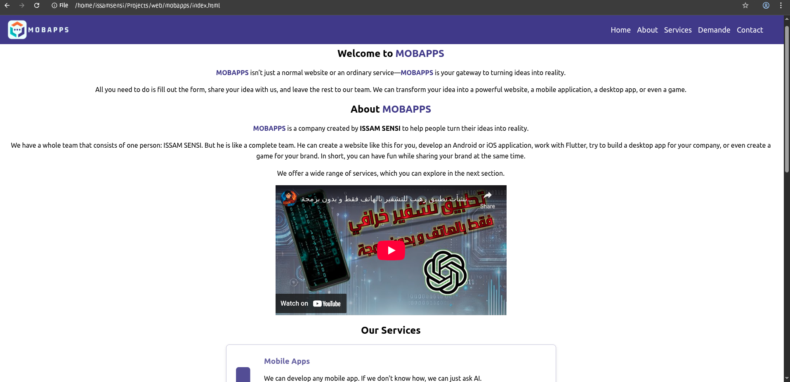
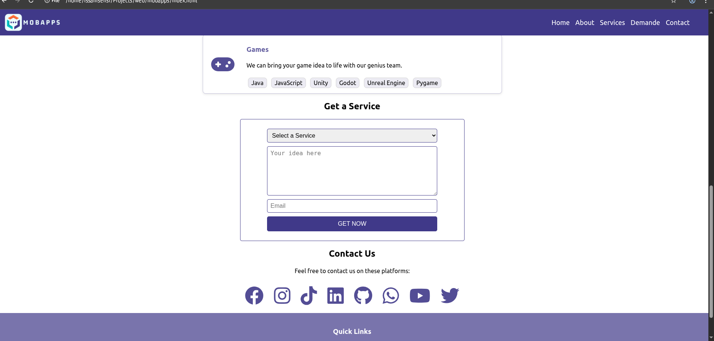

# MobApps

Welcome to **MobApps** – your one-stop solution for turning ideas into reality! Whether you want a website, a mobile app, a desktop application, or even a game, MobApps is here to help you bring your vision to life.

## 🚀 Project Overview
MobApps is a modern, responsive landing page and service portal for a one-man software powerhouse. It showcases the services offered, technologies used, and provides a direct way for clients to submit their ideas and get in touch.

## 🌐 Live Demo
[View Demo](https://issamsensi.github.io/MOBAPPS/)

## 🌟 Features
- **Modern, Responsive Design**: Looks great on all devices.
- **Service Showcase**: Highlights expertise in mobile apps, websites, and games.
- **Direct Service Request**: Simple form for users to submit their ideas and contact details.
- **Social Links**: Connect with MobApps on all major platforms.
- **Embedded Video**: Engaging introduction to MobApps.

## 🛠️ Technologies Used
- **Frontend**: HTML5, CSS3, JavaScript
- **Frameworks & Tools**: 
  - Mobile: Java, Flutter, Android Studio, XML
  - Web: HTML, CSS, JavaScript, Python (Flask, Django), PHP, SQL (MySQL, SQL Server, SQLite)
  - Games: Java, JavaScript, Unity, Godot, Unreal Engine, Pygame
- **Icons**: Font Awesome

## 📦 Project Structure
```
index.html      # Main landing page
styles.css      # Custom styles for the site
```

## 📸 Screenshots




## ✨ How to Use
1. **Clone the repository**
   ```zsh
   git clone https://github.com/issamsensi/mobapps.git
   cd mobapps
   ```
2. **Open `index.html` in your browser**
3. **Explore the services and submit your idea using the form!**

## 📬 Contact & Socials
- [Facebook](https://facebook.com/issamsensi)
- [Instagram](https://instagram.com/issamsensi)
- [TikTok](https://www.tiktok.com/@issamsensi)
- [LinkedIn](https://www.linkedin.com/in/issam-amghar-406b3a228)
- [GitHub](https://github.com/issamsensi)
- [WhatsApp](https://wa.me/+212658987985)
- [YouTube](https://youtube.com/@issamsensi?si=4ZpR37-s4ifInfwj)
- [Twitter/X](https://x.com/issamsensi)

## 👤 Author
**ISSAM SENSI**  
Founder, Developer, and the entire MobApps team!

---
© 2025 [issamsensi](https://github.com/issamsensi)
